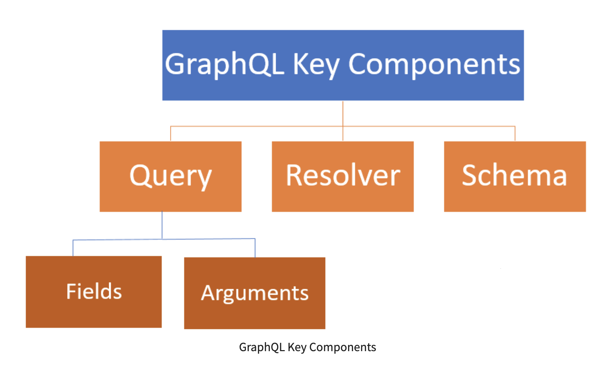

# GraphQL Tutorial: What is GraphQL? Learn with Example


1. [What is GraphQL](#what-is-graphql)
2. [Why use GraphQL?](#why-use-graphql)
3. When to use GraphQL?
4. GraphQL Key Components
5. Features of GraphQL
6. GraphQL Clients
7. GraphQL Servers
8. GraphQL Gateways
9. What is the variable in GraphQL?
10. What is Mutation?
11. Difference between GraphQL and REST
12. Disadvantages of GraphQL
13. Open Source Apps and Tools used by GraphQL


## What is GraphQL?

GraphQL is an application layer server-side technology which is developed by Facebook for executing queries with existing data. GraphQL can optimize RESTful API calls. It gives a declarative way of fetching and updating your data. GraphQL helps you to load data from server to client. It enables programmers to choose the types of requests they like to make.

In this GraphQL tutorial for beginners, you will learn GraphQL basics:


## Why use GraphQL?

Following are the reasons of using GraphQL:

* It provides a human-readable query.
* In GraphQL, it is very easy to deal with many database.
* It is suited for microservices and complex systems.
* You can fetch data with a single API call.
* It helps you with query batching and caching.
* You do not face, over, and under fetching problems.
* Tailoring requests to your needs.
* It helps you to discover the schema in the appropriate format.
* GraphQL automatically keeps documentation in sync with API changes.
* API evolution is possible without versioning.
* GraphQL fields are used in multiple queries that can be shared to a higher component level for reuse.
* You can choose which functions to expose and how they work.
* It can be used for rapid application prototyping.


## Applications of GraphQL

Here are the important applications of GraphQL:

* It provides Relay and other client frameworks
* GraphQL helps you to improve the performance of the mobile app.
* It can reduce over fetching problem to lower server-side cloud service and decrease the client-side, network usage.
* It can be used when the client application has to specify which fields are needed in long query format.
* GraphQL can be fully utilized when you have to add functionality to your old or existing API.
* It is used when you have to simplify complex API.
* Mix and mash façade pattern, which is commonly used in object-oriented programming.
* When you have to aggregate data from more than one place into one convenient API.
* You can use GraphQL as an abstraction on an existing API to specify response structure based on user needs.


## What do you need to learn before learning GraphQl?

This GraphQL tutorial is based on [Express](https://www.guru99.com/node-js-express.html) and [NodeJs](https://www.guru99.com/node-js-tutorial.html). Therefore, you can learn GraphQL very easily with a basic understanding of NodeJS.



  As shown in the above figure, there are three key components of GraphQL: 1) Query, 2) Resolver, and 3) Schema.

### Query:

The Query is an API request made by the client machine application. It supports augments and points to arrays. Query is used to read or fetch values.

#### Parts of Query:

Following are the important parts of Query

##### 1. Field
  
  A field simply indicates that we are asking the server for particular information. Following is a GraphQL example of a field in graphQL query.

```language
  query {
    team {
        id name
    }
  }
  "data": {
     "team":[ {
        "id": 1, 
        "name": "Avengers"
     }
     ,
     …
    ]
   }
  }
```

  In the above GraphQL example, we ask the server for the field called team and its subfields like id and name. The GraphQL server returns data in we asked for.
  
##### 2. Arguments

  In [REST](https://www.guru99.com/testing-rest-api-manually.html), we can only pass a single set of arguments as URL segments and query parameters. To get a particular profile, a typical REST call will look like the following:
  
```language
  GET /api'team?id=2 Content-Type: application JSON
   {
      "id": 2, 
      "name": "Justice League."
   }
```

### Resolver:

Resolvers provide the directions for converting GraphQL operation into data. They resolve the query to data by defining resolver functions.

It displays the server the process as well as location to fetch data according to a specific field. The resolver also separates database schema and API schema. The separated information helps to modify the content obtained from the database.

### Schema:

A GraphQL schema is the center of GraphQL implementation. It describes the functionality available to the clients which are connecting to it.


## Features of GraphQL

Here are important features of GraphQL:

* It provides declarative query language, which is not imperative.
* It is hierarchical and product-centric.
* GraphQL is strongly typed. It means queries are executed within the context of a particular system.
* Queries in GraphQL are encoded in the client, not in the server.
* It has all the features of the application layer of the OSI model.

## GraphQL Clients

GraphQL client is a code that makes POST requests to a relevant GraphQL Server. You can query a GraphQL API directly, but the good approach is to leverage a dedicated client library using Relay.

This JavaScript library is developed by Facebook for making React applications with GraphQL. GraphQL clients can be a CMS like Drupal, a single page application, a mobile application, etc.

## GraphQL Servers

GraphQL servers are servers side implementation of GraphQL’s specification. It depicts your data as GraphQL API, which your client program can query for the database.

## GraphQL Gateways

Gateway is a microservice pattern where you can build a separate service to cope up with other backend services. It offers workable documentation and gives a convenient way to collect data from more than one source with a single request.

## What is the variable in GraphQL?

A Variable in GraphQL is used to separate the dynamic values from the client query and pass the query as a unique dictionary. Variable in GraphQL can also be used for reusing the query or mutations written by the client with individual arguments. In graphQL, you cannot pass dynamic arguments directly in the query string. The reason is client-side code needs to manipulate query string dynamically at the time when you run the program.

GraphQL has one good way to factorize the dynamic values out of the query. It passes them as a separate dictionary. These values are known as variables. Whenever we working with variables, we need to do the following three things:

  1. Replace the static value in the query with a variable name.
  2. Declare the variable name as one of the variables that are accepted by the GraphQL query.
  3. Pass the value in the transport-specific dictionary of variables.

Here’s what it looks like all together:

```language
query HeroNameAndFriends($episode: Episode) {
  hero(episode: $episode) {
    name
    friends {
      name
    }
  }
}
{
  "episode": "JEDI"
}
{
  "data": {
    "hero": {
      "name": "R2-D2",
      "friends": [
        {
          "name": "Luke Skywalker"
        },
        {
          "name": "Han Solo"
        },
        {
          "name": "Leia Organa"
        }
      ]
    }
  }
}
```

As you can see in the above GraphQL example, we have simply passed a different variable other than needing to construct a new query.

## What is Mutation?

A mutation is a way to change the dataset in GraphQL. It modifies data in the data store and returns a value. Mutations help you to insert, update, or delete data. Generally, mutations are defined as a schema part.

### Points to consider while designing GraphQL mutations:

Here are the important points while designing GraphQL:

  **Naming:** First of all, you have to name your mutations verb. Then the noun, or “object” if applicable. Use camelCase while naming mutations.
  **Specificity:** You have to make mutation-specific as much as possible. Mutations should represent semantic actions taken by the user.
  **Input object:** Use a one, unique, required, input object type as an argument for executing mutation on the client.
  **Unique payload type:** You should use a unique payload type for every mutation. You can also add the mutation output as a field to that particular payload type.
  **Nesting:** Use nesting to your mutation wherever it makes sense. It allows you to fully utilize GraphQL API.
  
  ## Difference between GraphQL and REST
  
  Following table shows important difference between [GraphQL and REST](https://www.guru99.com/graphql-vs-rest-apis.html).
  
  |GraphQL|REST|
  |-------|----|
  |It follows client-driven architecture.|It follows server-driven architecture.|
  |GraphQL can be organized in terms of a schema.|REST can be organized in terms of endpoints.|
  |GraphQL is a growing community.|REST is a very large community.|
  |The development speed in GraphQL is fast.|The development speed in REST is Slow.|
  |The learning curve in GraphQL is difficult.|The learning curve in REST is moderate.|
  |The identity is separated from how you fetch it.|The endpoint you call in REST is the identity of a particular object.|
  |In GraphQL, the server determines available resources.|The shape and size of the resource is determined by the server in REST.|
  |GraphQL provides high consistency across all platforms.|It is hard to get consistency across all platforms.|


## Disadvantages of GraphQL

Here are the GraphQL disadvantages:

* Young ecosystem
* Lack of resources on the backend part.
* Missing design pattern for a complex app.
* Performance issues with complex queries.
* Overkill for small applications
* GraphQL does not depend on the HTTP caching methods that enable storing request content.
* GraphQL does not understand files. Hence, a file uploading feature is not included in it.
* With GraphQL, be prepared to have a lot of pre-development education like learning the Schema Definition Language.

## Open Source Apps and Tools used by GraphQL
The important open source apps and tools used by GraphQL are as follows:

[**Gatsby:**](https://www.gatsbyjs.org/) Gastby is an application powered by GraphQL that can use data which is derived from more than one GraphQL API source. You can use it to develop a static and client-based React application.

[**GraphiQL:**](https://github.com/graphql/graphiql) It is an ID that integrates with the browser and also interacts with the API of GraphQL. Some of the functions that GraphiQL includes are mutations, data querying, and autocompletes queries.

[**GraphQL Playground:**](https://www.npmjs.com/package/graphql-playground) It is a powerful IDE that has an in-built editor for handling mutations, validation, GraphQl queries, subscriptions, etc. The developer can use this IDE to visualize the structure of the schema.

[**Prisma:**](https://www.prisma.io/) Prisma is a database abstraction layer which turns your databases into GraphQL APIs with CRUD (Create, Read, Update and Delete) operations.

[**Bit:**](https://bit.dev/) It is open-source tool and platform that converts reusable code into components. Developers can use them to share and develop various projects.


## Summary

* GraphQL is an application layer server-side technology which is developed by Facebook for executing queries with existing data.
* You can use GraphQL to fetch data with a single API call.
* GraphQL helps you to improve the performance of the mobile app.
* Important GraphQL query components are: 1) Query, 2) Resolver, 3) Schema.
* GraphQL is strongly typed. It means queries are executed within the context of a particular system.
* GraphQL client is a code that makes POST requests to a relevant GraphQL Server.
* GraphQL servers are servers side implementation of GraphQL’s specification.
* Gateway is a microservice pattern where you can build a separate service to cope up with other backend services.
* GraphQL has one good way to factorize the dynamic values out of the query.
* A mutation is a way to change the dataset in GraphQL.
* The important points while designing GraphQL are: 1) Naming, 2) Specificity, 3) Input object Unique payload type, and 4) Nesting.
* GraphQL can be organized in terms of a schema, whereas REST can be organized in terms of endpoints.
* The disadvantage of GraphQL is that it lacks of resources on the backend part.
